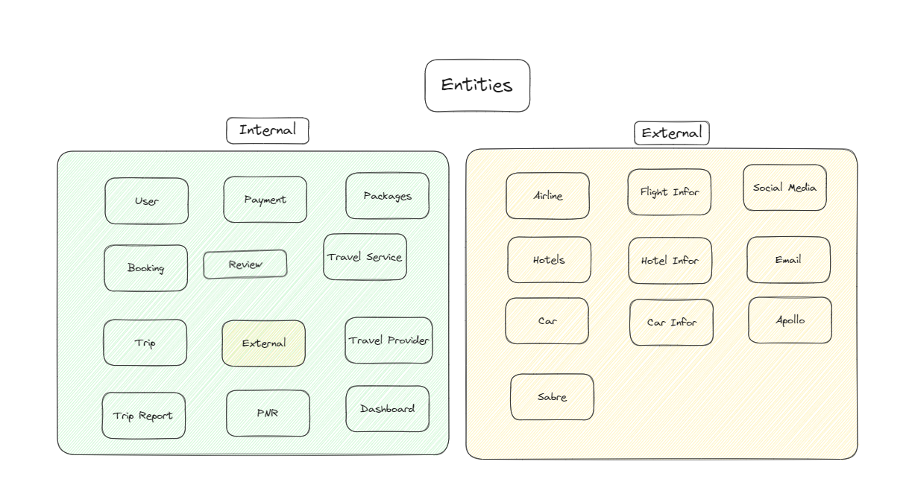
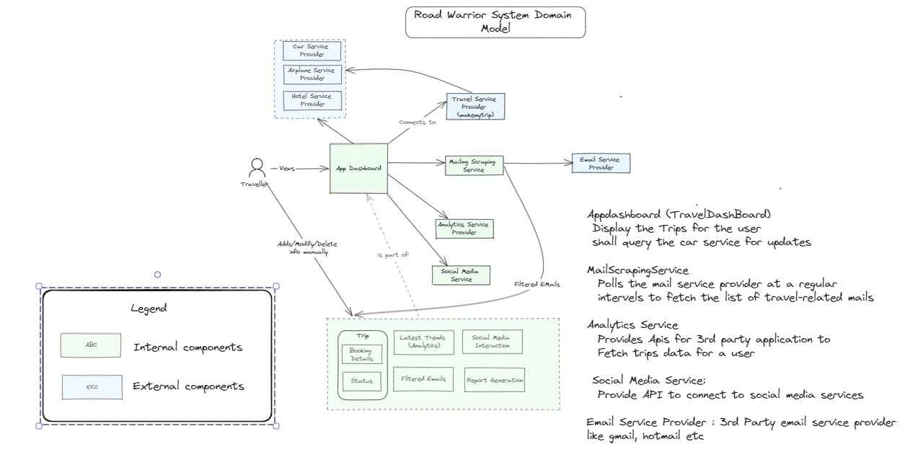
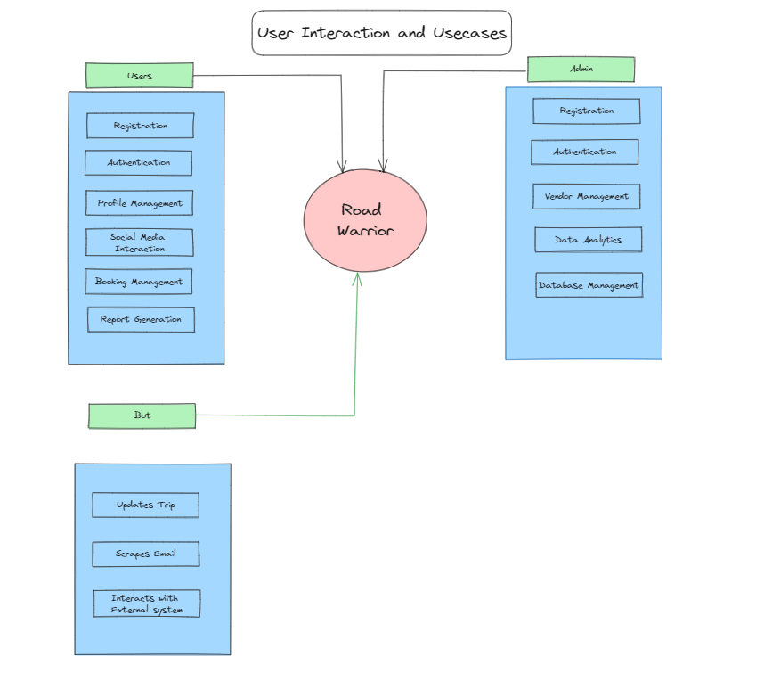
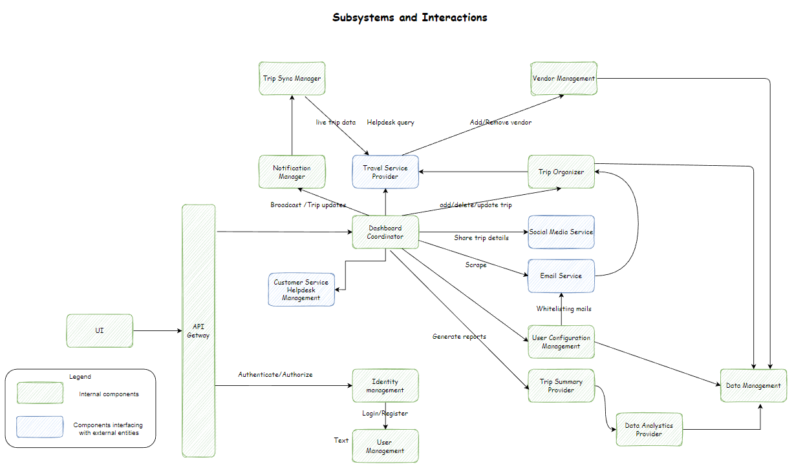
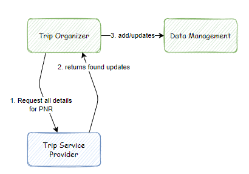

# System Scope and Context {#section-system-scope-and-context}

## Domain Model

## High level User Interaction and Use Cases

## Sub-system interaction

## Use case illustrations

The interactions between these subsystems are detailed by the major use cases below

### Register new user

### Login

* On the Login/Authenticate call Identity Management checks User credentials with User Management
* Inform Dashboard Mgr of active user [will be useful for further use cases...]
* Return valid bearer token
* Valid bearer token is must for all further use case calls

**NOTE**: ApiGateway will reject all subsequent calls with invalid bearer tokens
Also for simplicity sake in below diagrams The API Gateway is not explicitly shown

### Add Email Whitelist/filters

1. User config management has the responsibility to add/update/get email and filter information

**NOTE**: Use of User Config Management Service is illustrated in next interaction

### Auto update via E-mail polling

1. Dashboard Manager activates Email Service for polling and scraping emails
2. Email Service get users whitelist/filters thru User Config Management
3. Informs Trip Organizer of trip/booking data from E-mail. E.g. data extracted PNR
4. Trip Organizer will check if data is newer and commit

**NOTE**: Trip Organizer also works with Trip Service Provider to get more details on the Trip/Booking

### User manually adds/updates Trips

In this interaction Dashboard Manager directly interacts with Trip Organizer

## Subsystem Details

* Email Service

  * Interfaces with different mailing services to get and scrape the user mails. Works as an aggregator for all the mail service provider.

* Travel Service provider

* Interfaces with 3rd party travel providers{eg. make my trip} and air,hotel, car rental service provider. To get
  * more details on PNR.
  * updates etc

* TripOrganizer

  * Key component on the dashboard using which trip details are managed (Add/Modify/delete)
  * PNR Handling

* Road Warrior DashboardManager
  * Overarching component which encapsulates different service on the UI

* DataAnalyticsManagement
  * Used for user behavior tracking

* Trip Summary Provider
 
  * Provides analytical options (What are the different data mining options available for traveler) to UI
  * Generates reports

* Vendor Management
 
  * Onboard/Adds/Removes third part vendors which provide booking services such as Airlines, Cars and Hotels

* Identity Management (Authentication & Authorization)
 
  * OAuth2 integration
  * User Management

* Social Media Service :
 
  * Interface with various social media providers
  * Enables user of the RW Dashboard to share the trip info

* UserConfigurationManagement
  * User related settings like whitelisting emails

* Data Management : Encapsulates storage and retrieval of Trip/Booking/User information.
  * Also handles quick reads
  * caching of recent user data
  * Secure write/updates
  * Will be used by other services in RW backend

* TripSyncManager:
  * Get the live data (real world updates) from the travel service provider.

* NotificationManager:
 
  * Handles the notification to the user for changes and updates in itinerary
  * Broadcast messaging to all users (e.g. ads [ads may need to be as per user profiles], emergency updates)

* EventHub/CommunicationMgr
  * Handles communications across services and components

* UserManagement
  * Used for new user registration

* API Gateway :
  * Manages routing, load balancing etc and wil be the entry point for the UI layer for Web and Mobile app

* CustomerServiceAndHelpdeskManagement
 
  * Integrates to various travel aggregators helpdesk
