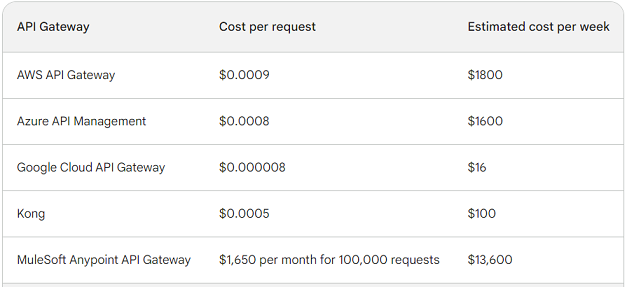

# Title: ADR-002: API Gateway
## Date: 2023-09-14
## Status: Accepted
## Context
We are building a new software system that will expose a variety of APIs to our customers. We need to choose an API gateway that will help us to:
*	Secure our APIs
*	Scale our APIs
*	Integrate our APIs with other services
*	Support the programming languages and microservices that we are using
## Decision
Based on the evaluation of various criteria and operation cost Google Cloud API Gateway is the best Road Warrior 

<b><u>Criteria choose to evaluate API Gateway:</u></b>

*	Scalability and Performance: The API gateway must be able to handle a high volume of requests.
*	Security: The API gateway must support a variety of security features, such as OAuth 2.0 and IP whitelisting.
*	Integration: The API gateway must be able to integrate with a variety of other services.
*	Programming languages and microservices supported: The API gateway must support the programming languages and microservices that we are using.
*	Cost: The API gateway must be affordable for our budget.
*	Ease of use: The API gateway must be easy to use and configure.
*	Support: The API gateway must offer good support in case we need help.

<b><u>Operating Cost</u></b>
Assuming 2 million active users per week, and that each user makes an average of 10 requests per week, then a total of 20 million requests per week.

## Consequences
* Google Cloud API Gateway does not support as many programming languages like C,C++,Go,Rust,Assembly,Pascal,Modula-2.Fortran
* Google Cloud API Gateway can be complex to set up and configure.
* Google Cloud API Gateway may have performance issues under heavy load.

## Mitigation Strategies
* You can use an API client library to access Google Cloud API Gateway from any programming language 
* There are a number of tutorials and documentation available to help you set up and configure Google Cloud API Gateway
* Use a load balancer to distribute traffic across multiple Google Cloud API Gateway instances
## Next Steps
Google Cloud API Gateway will be considered for the Architecture design. We will also need to develop a security policy for our APIs and implement it.

