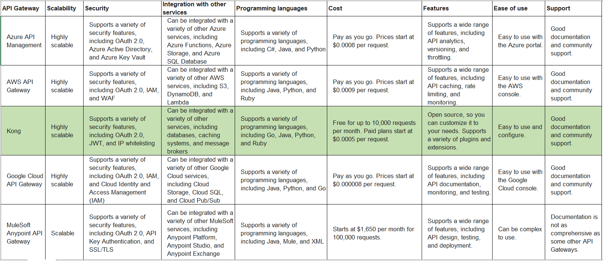

# Title: ADR-002: APIGateway
## Date: 2023-09-14
## Status: Accepted
## Context
We are building a new software system that will expose a variety of APIs to our customers. We need to choose an API gateway that will help us to:
*	Secure our APIs
*	Scale our APIs
*	Integrate our APIs with other services
*	Support the programming languages and microservices that we are using
## Criteria
We will use the following criteria to evaluate API gateways:
*	Scalability: The API gateway must be able to handle a high volume of requests.
*	Security: The API gateway must support a variety of security features, such as OAuth 2.0 and IP whitelisting.
*	Integration: The API gateway must be able to integrate with a variety of other services.
*	Programming languages and microservices supported: The API gateway must support the programming languages and microservices that we are using.
*	Cost: The API gateway must be affordable for our budget.
*	Ease of use: The API gateway must be easy to use and configure.
*	Support: The API gateway must offer good support in case we need help.

## Summary
After evaluating the different API gateways, we have decided to use Kong. Kong is an open-source API gateway that is highly scalable, secure, and easy to use. It supports a variety of security features, including OAuth 2.0, JWT, and IP whitelisting. It can be integrated with a variety of other services, including databases, caching systems, and message brokers. It supports a variety of programming languages, including Go, Java, Python, and Ruby. It is free for up to 10,000 requests per month, and paid plans start at $0.0005 per request.
## Rationale
Kong was chosen over the other API gateways because it met our requirements for scalability, security, integration, programming languages and microservices supported, cost, ease of use, and support.
## Next Steps
We will now install and configure Kong to expose our APIs to our customers. We will also need to develop a security policy for our APIs and implement it in Kong.
## Conclusion
We believe that Kong is the best API gateway for our needs. It is a highly scalable, secure, and easy-to-use API gateway that supports a variety of programming languages and microservices. We are confident that Kong will help us to deliver our APIs to our customers securely and reliably.

