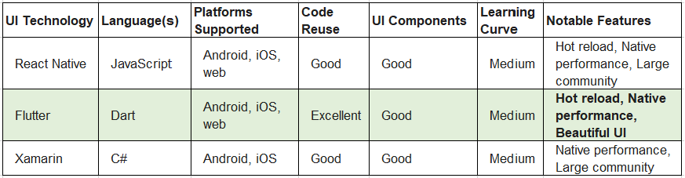

# Title: ADR-003: UI Technology
## Date: 2023-09-14
## Status: Accepted

## Context
We need to choose a UI technology that is compatible with Android, iOS, web and has good performance. This will allow us to develop a unified user experience across all platforms.
We also want to consider the code reuse, UI components, learning curve, and notable features.
 
## Decision
We have decided to choose Flutter as our UI technology. Flutter is a cross-platform UI framework developed by Google. It uses the Dart programming language, which is a modern, fast, and expressive language

## Consequences
The main consequence are 
* learn a new framework and programming language. 
* Flutter apps may not be as mature as React Native apps. However, Flutter is a rapidly evolving framework, and it is quickly gaining popularity.

## Mitigation
To mitigate the risk of performance issues, we will use a number of techniques, such as:
* Flutter is a popular framework with a large community, so there are plenty of resources available to help us learn.

## Next steps
* Learn the basics of Flutter.
* Start developing our cross-platform app.
* We will also need to monitor the performance of our Flutter and make adjustments as needed.
