# Key Sub systems

[To go back](./README.md)

todo delete old plntuml [Subsystems-Interaction](./.media/Subsystems-Interaction.png)

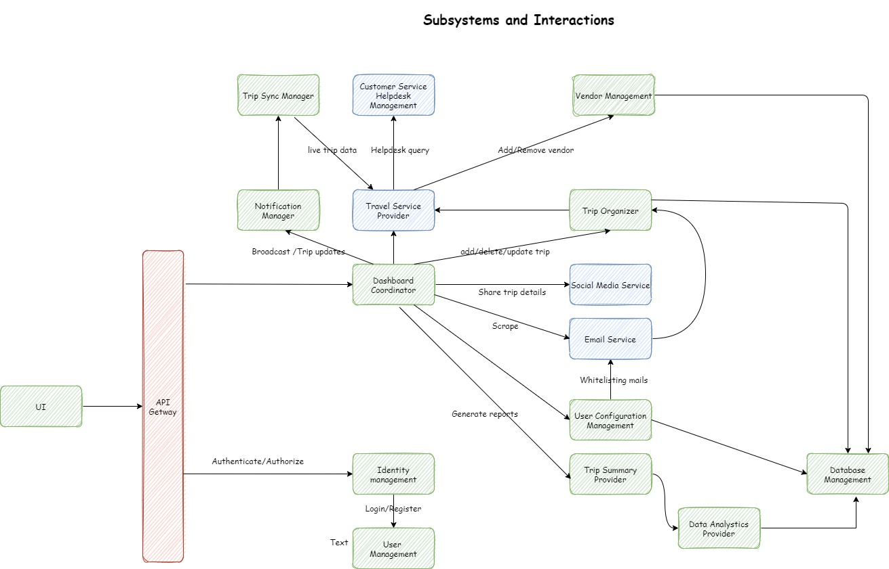
* Email Service:
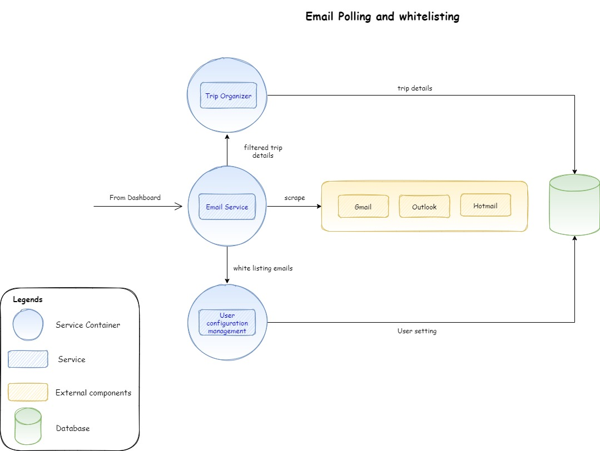
  * Interfaces with different mailing services to get and scrape the user mails. Works as an aggregator for all the mail service provider.
* Travel Service Provider: 
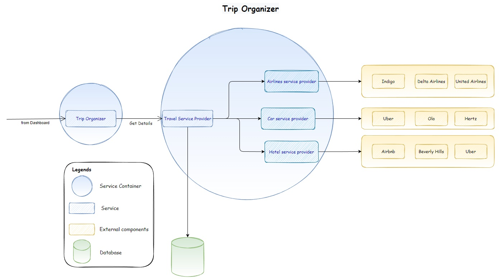
* Interfaces with 3rd party travel providers{eg. make my trip} and air,hotel, car rental service provider. To get
  * more details on PNR.
  * updates etc
* TripOrganizer:
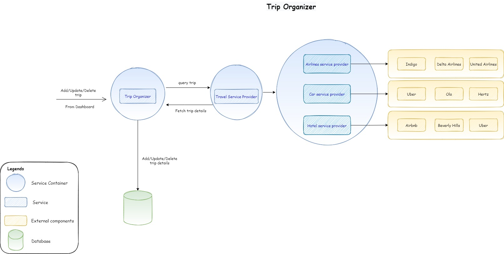
  * Key component on the dashboard using which trip details are managed (Add/Modify/delete)
  * PNR Handling
* Road Warrior DashboardManager
  * Overarching component which encapsulates different service on the UI
* DataAnalyticsManagement
  * Used for user behavior tracking
* Trip Summary Provider 
 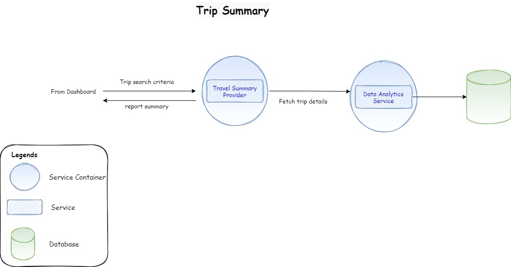
  * Provides analytical options (What are the different data mining options available for traveler) to UI
  * Generates reports
* Vendor Management :
 
  * Onboard/Adds/Removes third part vendors which provide booking services such as Airlines, Cars and Hotels
* Identity Management (Authentication & Authorization)
 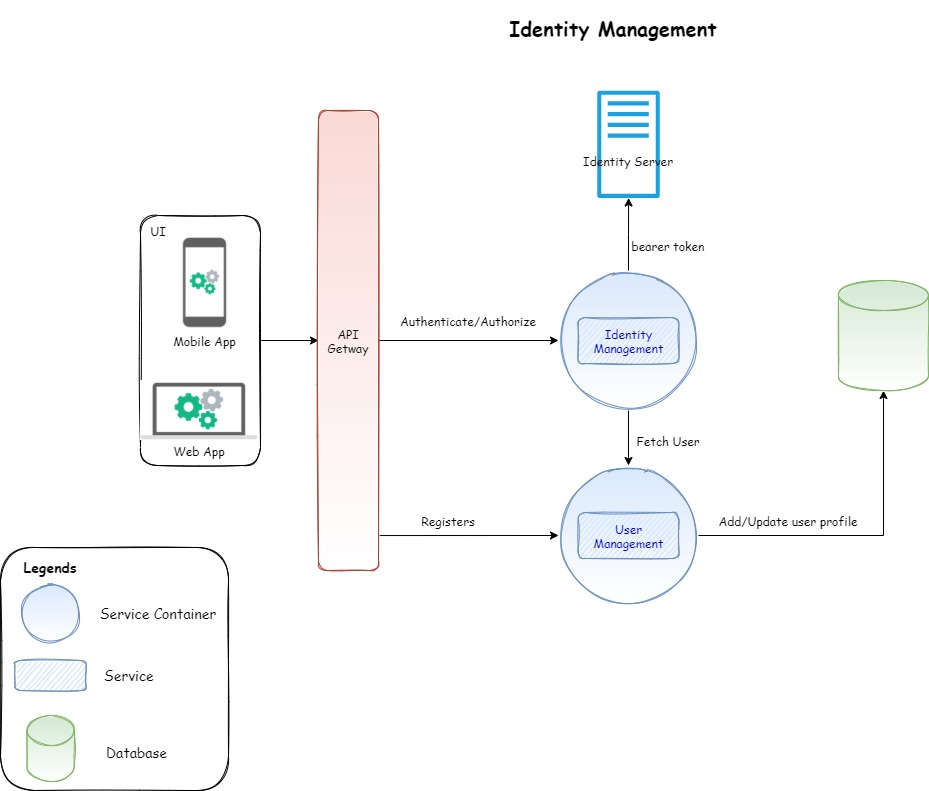
  * OAuth2 integration
  * User Management
* Social Media Service :
 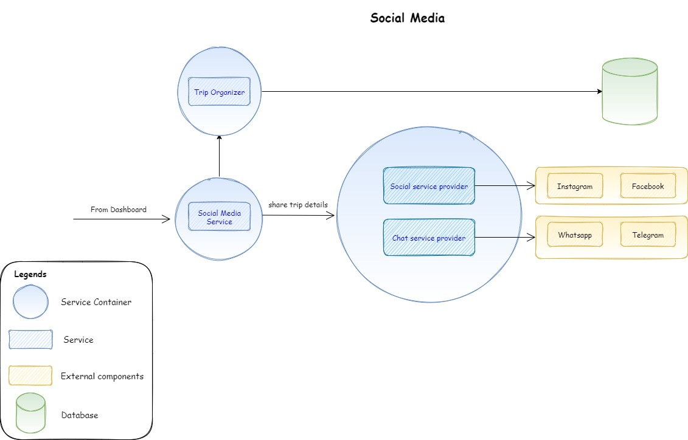
  * Interface with various social media providers
  * Enables user of the RW Dashboard to share the trip info
* UserConfigurationManagement
  * User related settings like whitelisting emails
* Data Management : Encapsulates storage and retrieval of Trip/Booking/User information.
  * Also handles quick reads
  * caching of recent user data
  * Secure write/updates
  * Will be used by other services in RW backend
* TripSyncManager:
  * Get the live data (real world updates) from the travel service provider.
* NotificationManager:
 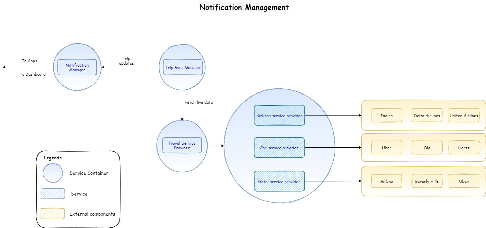
  * Handles the notification to the user for changes and updates in itinerary
  * Broadcast messaging to all users (e.g. ads [ads may need to be as per user profiles], emergency updates)
* EventHub/CommunicationMgr
  * Handles communications across services and components
* UserManagement
  * Used for new user registration
* API Gateway :
  * Manages routing, load balancing etc and wil be the entry point for the UI layer for Web and Mobile app
* CustomerServiceAndHelpdeskManagement
 
  * Integrates to various travel aggregators helpdesk

## Usecases illustrated
The interactions between these subsystems are detailed by the major usecases below

### Register new user
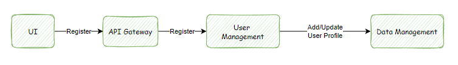
### Login
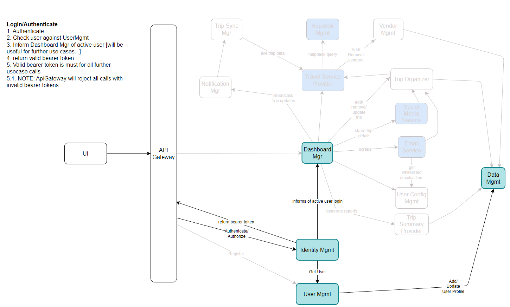
### Add Email Whitelist/filters
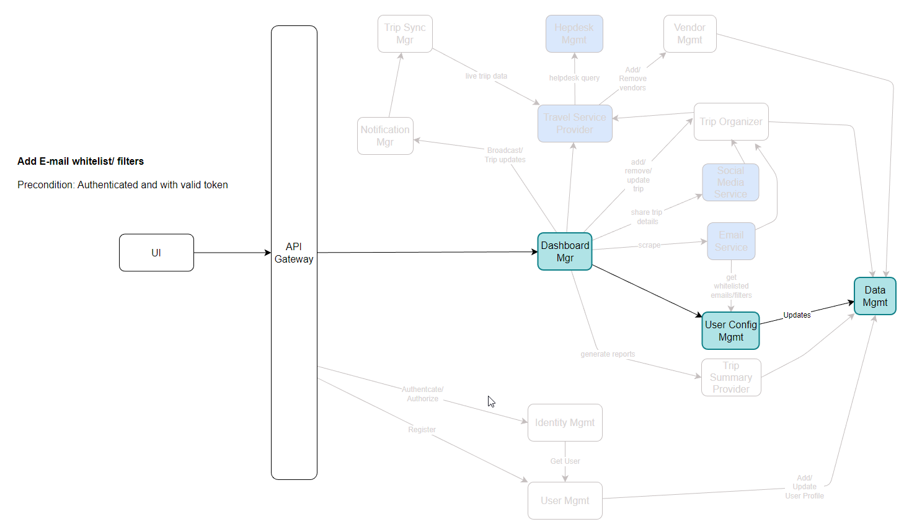
### User AdReUp Trips
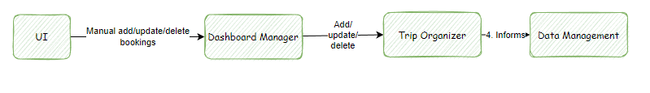
### Auto update via E-mail polling
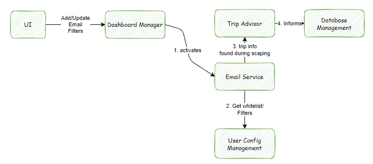

### Adding new Vendor interfaces

### Updates via 3rd party travel services

### Notifications to user

### Analytics and End of Year Summary report

### Raising helpdesk calls

***

### [To go back](./README.md)