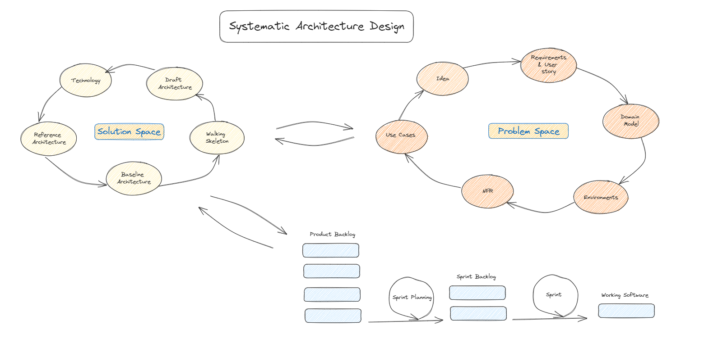
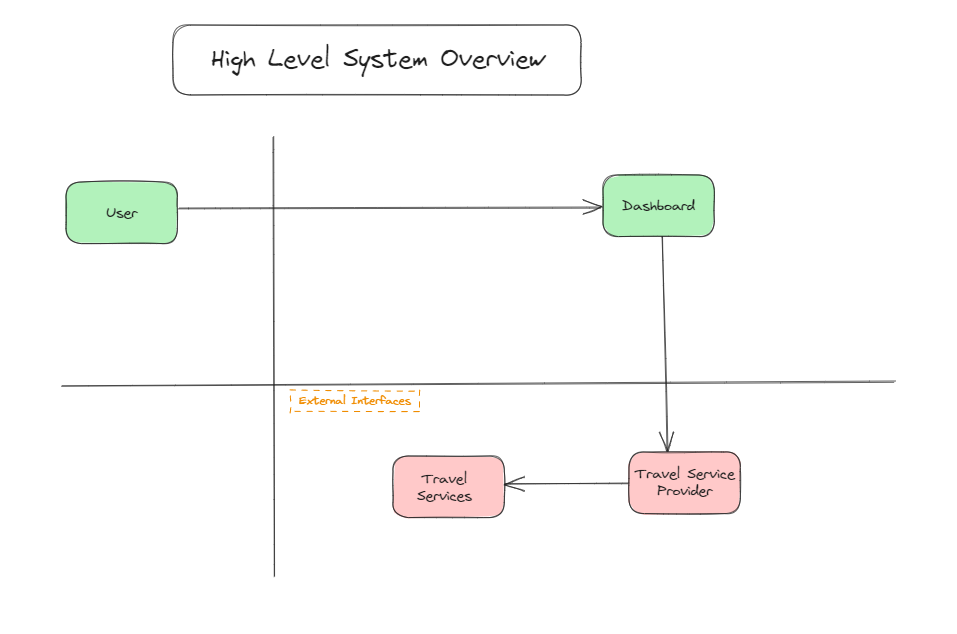
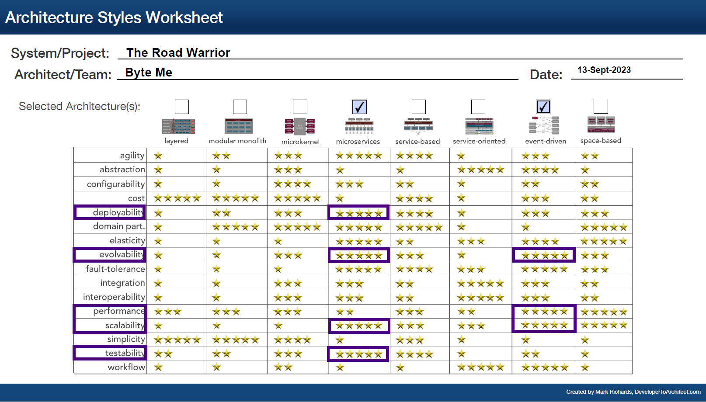

# O'Reilly Architecture Kata September 2023

This is a team submission for O'Reilly [Architecture Katas 2023](https://learning.oreilly.com/featured/architectural-katas/).

Team Members

- Manohar M
- Sairam Sadanandan
- Somaraj K
- Shreyas Udupi
- Shashwat Bajpai

## Table of Contents

- Introduction
- Business Context
  - Requirements  
  - Constraints
  - Risks  
  - Assumptions
- [ArchitectureApproach](#systematic-architecture-design)
  - [Idea](#idea)
  - [Requirements](#requirements)
  - [DomainModel](#domain-model)
  - [Environment](#environment)
  - [NFR](#nfr)
  - [HighLevelArchitecture](#architecture)
  - [KeySubsystems&Design]  
  - [ADR]
    - [TypeOfArchitecture]
    - [CommunicationProtocol]
    - [DeploymentStrategy]
    - [Scalability]
  - [Diagram]
    - [UserJourney]
    - [SequenceDiagram]
    - [DeploymentView]
    - [WireFrames***]
    - [SystemLevelViews]
    - [CICD]
  - [Testability]
    - [TestStrategy]
  - [CrossCuttingConcerns]
    - [Logging]
    - [Auditing]
    - [Monitoring]
      - [AppInsights]
    - [Security]
      - [RateLimiting]
      - [DataIntegrity]
      - [Confidentiality]

## Target for 13/09

- Business description and context setting
- Sub system interaction with high level choice of technologies/tooling
- High level architecture finalized

## Target for 14/09

- All sub systems High level design
- Testability
- ADR

## Target for 15/09

- NFR handling and associated diagram representation
- Final flow walkthrough

## Introduction

"The Road Warrior" is an online trip management company which allows travelers to see all the of their existing reservations organized by the trip. Below is the list of key features which this application provides:

- User-Friendly Dashboard: Provides an intuitive and user-friendly dashboard that allows travelers to easily view, manage, and organize their reservations.

- Reservation Aggregation: The core functionality is aggregating reservations from various sources, including flights, hotels, car rentals etc.

- Trip Organization: Allow users to organize their reservations into trips. This could involve creating tags for each trip, making it easy for users to access the details of a specific journey.

- Booking Management: Enables users to make changes to their reservations directly through the dashboard, such as modifying flight dates or hotels.

- Real-Time Updates: Ensures that the dashboard provides real-time updates on flight statuses, gate changes, delays, and other relevant information.

- Notification System: Implements a notification system that alerts users about upcoming trips, booking confirmations, or changes to their reservations.

## Business Context

In today's world when you plan for a trip, there are a lot of things to consider. It starts from booking the flight to the destination, to then booking a hotel for your stay. But how do you go from Airport to Hotel? Oh yes, you need car rentals as well.
There are lot of options out there which provides the travelers the best possible options to do all the booking mentioned above like Expedia, Thomas Cook, MakeMyTrip and so on.
Now, if there are already so many option available, why do we need yet another travel website?
First of all, "The Road Warrior" is not just another travel website. It's a travel aggregation solution for all the travel needs.
Let's think of one scenario, where as a user, you have booked your flight ticket from Expedia, booked your stay in AirBnb and have booked the car in Uber. On the day of travel you have to continuously keep switching between different apps to check your bookings.
Well no longer, this is where "The Road Warrior" comes in. We will aggregate all your booking under one trip so you will never have to bother about checking the status of your booking in multiple applications.
I know what you might be thinking, I have already gone through the hassle of booking the travel from multiple applications, I don't want to go through the trouble of adding these details to another app to get the updates. Don't worry, "The Road Warrior" has got you covered.
Our app will automatically look for for travel booking and will add these under a single trip.
We also provide data insights on the basis on past travel history and recommend accordingly.
"The Road Warrior" is your  travel buddy.

### Business Considerations

- Data Privacy and Security
- Monetization
- Global Reach
- Travel Recommendations
- Customer Support
- Scaling

## Systematic Architecture Design

For this architecture challenge we have followed the systematic architecture design (SAD) technique. 
The SAD is broadly categorized into 2 categories:

1) Problem Space
2) Solution Space

### Problem Space

The major components involved in the problem space are:

- Idea : In this phase we define the the customer need/wish.

- Requirement & User Story: The is the phase we perform the requirement elicitation and document the requirement as for of user stories.

- Domain Model : In this phase we use a common language to define the entities, problem domain and the interaction between them. The domain model will also include the constraints and boundaries

- Environments: In this phase we define the environment which impact the design such as Existing Systems, Budget, Timelines etc.

- NFR : In this phase we define all the non-functional requirements such as quality scenarios, quality tree, architectural drivers.

- Use Cases: In this phase we define the interaction between the components.  

## Idea

"The Road Warrior" is an online trip management company which allows travelers to see all the of their existing reservations organized by the trip.

## Requirements

The requirements are defined here [Requirements](Requirements.md)

## Domain Model

- Entities: 

- High Level System Overview: 

- System Domain Model: 

- User Interaction and Use Cases: 

## Environment

## NFR

| S. No  | Characteristics | Status | Rationale |
| ----------- | -----------| ----------- | ----------- |
| 1) | Scalability |  [x] | The system needs to support multiple users from across the globe. In order to achieve this we should be able to scale our systems (components) horizontally. |
| 2) | Performance |  [x] | The system needs to support multiple users which means there will be high traffic and some of the scenarios (like gate change, cancellation) are time critical. In order to achieve this we should enforce/ define some architecture functions. |
| 3) | Availability |  [x] | The system needs to be available at all times (as the max downtime for the system is just 5 mins). |
| 4) | Usability |  [x] | As the system should have rich UI for the dashboard/summary report we should make sure that we have arch functions defined for usability. |
| 5) | Upgradeability |  [x] | We should be able to update and upgrade the system with additional feature. |
| 6) | Extensibility |  [x] | As the system might have multi vendor, multi service support, we need to make sure that there is no vendor lock-in and the system is easily extensible. |
| 7) | Security |  [x] | As this system stores user information we need to define architecture functions to handle security. |

Other topics to consider

Cost: Since we are talking about having multiple services and these services will be deployed across the continents. The cost is something we need to keep in mind.  
Configurable:
Confidentiality:
Integrity:
Authentication

## Architecture

- In order to chose the architecture, we followed the [Systematic Architecture Design](#systematic-architecture-design).
- In this approach, we first started with the problem domain and then moved toward a solution domain.
- In the solution domain, three different set of architectures.

1) Draft Architecture
  a) Draft architecture is a result of problem space.
  b) Independent of Technology & interfaces.

2) Reference Architecture
  a) This includes technical details.
  b) Uses the existing reference templates. For example, any other existing architecture which might have similar use cases.

3) Baseline Architecture
  a) Contains NFR solutions
  b) This architecture contains the architecture for existing environment. 

- After going through this iterative process we decided to go ahead with the .
- For deciding the underlying architecture we created an [ADR](ADR's/ADR-001-MicroservicesArchitecture.md)
