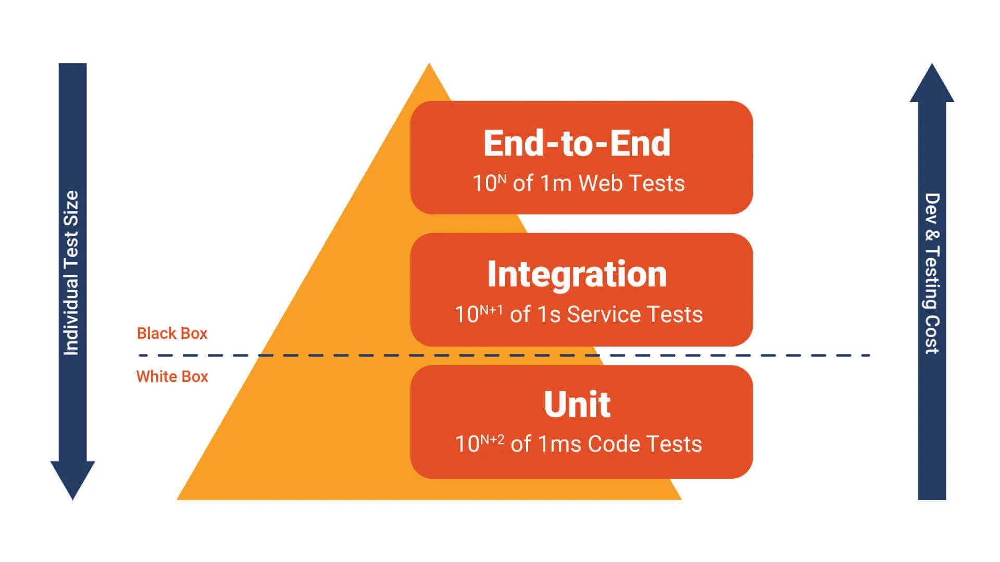

# Test Pyramid

## Objective

A test pyramid is a visualization of the different levels and types of tests in a software testing strategy, arranged in the shape of a pyramid to represent the distribution and priorities of these tests. Here's a test pyramid for The Road Warrior:

### Unit Tests

* Scope:
  Unit tests will focus on testing individual components or functions of the application in isolation. These are the smallest and fastest tests.
* Purpose:
  To verify the correctness of small code units in isolation.
* Examples:
  Test individual functions responsible for trip data retrieval, metrics calculation, Email scraping or other specific functionalities. For instance, a unit test for validating that the flight reservation data retrieval function works correctly.

### Integration Tests

* Scope:  
  Integration tests ensure that different components of the dashboard work together as expected. They test the interactions between various modules or services.
* Purpose:
  To validate that integrated components work together as expected.
* Examples:
  Test the integration of data sources (e.g., flight reservation APIs, hotel booking services) to confirm that data is correctly aggregated. Test how reservation updates made by users on the dashboard propagate to external systems.

### End-to-End (E2E) Tests

* Scope:
  End-to-end tests validate the entire trip management workflow, including user interactions with the web and mobile interfaces, data aggregation, and integration with external services.
* Purpose: To ensure that the complete application functions correctly from a user's standpoint and that major user flows work as expected.
* Examples:
  Test scenarios like creating a new trip, adding reservations to it, modifying a reservation, and receiving real-time notifications for flight updates. Test both the web and mobile versions of these workflows.

## Additional Considerations

## Load and Performance Testing

As the dashboard will handle a significant amount of data and user interactions, we need to consider including load and performance testing to ensure it can handle concurrent users and maintain responsiveness.

Below is the set of use cases to perform the load tests:

### Define Load Testing Scenarios

Identify the key user scenarios and interactions that you want to simulate during load testing. These scenarios may include:

* User registration and login.
* Creating new trips and adding reservations.
* Editing existing reservations.
* Viewing trip itineraries.
* Receiving notifications.
* Simulate a mix of read and write operations to mimic real user behavior.

### Set Load Testing Goals

Determine specific performance goals and criteria that you want to achieve during load testing. This should include response time thresholds, throughput, and the number of concurrent users we want to simulate

### Create Realistic Test Data

Generate or obtain realistic test data that mimics actual usage patterns. This data should include various trip scenarios, reservation types, and user profiles.

### Select Load Testing Tools

Load test tool allows us to create and execute load test scripts easily. Some popular load tools are Locust, JMeter etc.

### Develop Load Test Scripts

Create load test scripts that simulate user interactions with the application. These scripts will include the scenarios we defined earlier. Pay attention to user login, navigation, reservation creation, and other critical functions.

### Configure Test Environment

Set up an environment that closely resembles the production environment. Ensure that the infrastructure, databases, and external services are adequately configured to handle the load.

### Define Load Profiles

Determine the load profiles we want to simulate, such as steady-state loads, peak loads, or gradual ramp-up scenarios. Configure the load testing tool to simulate these profiles.

### Execute Load Tests

Run the load tests with the defined scripts, test data, and load profiles. Monitor various performance metrics during the test, such as response times, error rates, and resource utilization (CPU, memory, network).

### Analyze Test Results

Collect and analyze the results of your load tests. Identify performance bottlenecks, such as slow database queries, insufficient server resources, or inefficient code. Pay attention to any errors or issues that arise under load.

### Iterate and Optimize

Based on the test results, make optimizations to your application's performance. This may involve code optimizations, server upgrades, or changes to your infrastructure. Re-run the load tests to validate improvements.

### Scalability Testing

Perform scalability testing to determine how the system handles load when we increase resources, such as adding more servers or database instances. Ensure the system can scale horizontally or vertically as needed.

### Continuous Monitoring

Implement continuous monitoring in your production environment to track performance and detect issues in real-time. Use tools like application performance monitoring (APM) solutions to gain insights into the application's behavior in production.

### Document and Report

Document the load testing process, results, and any optimizations made. 
